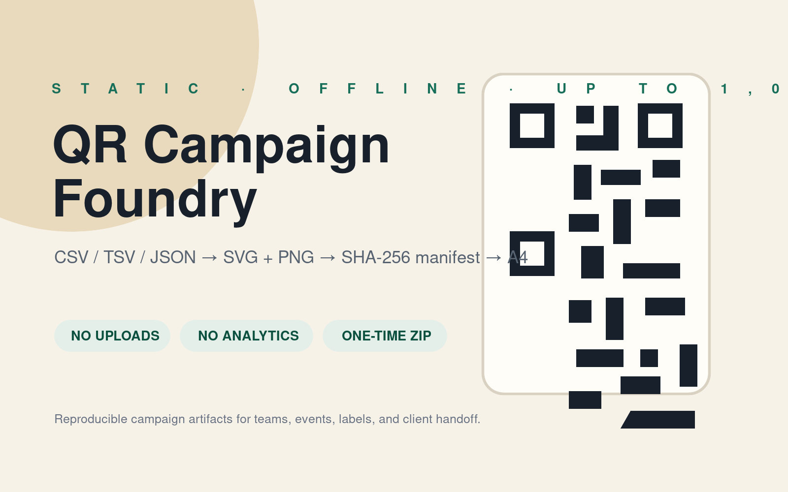
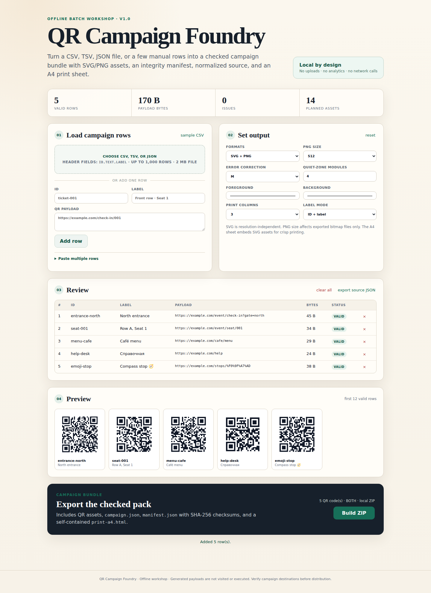
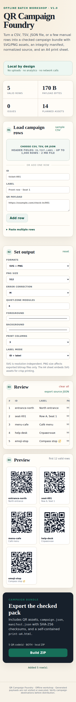
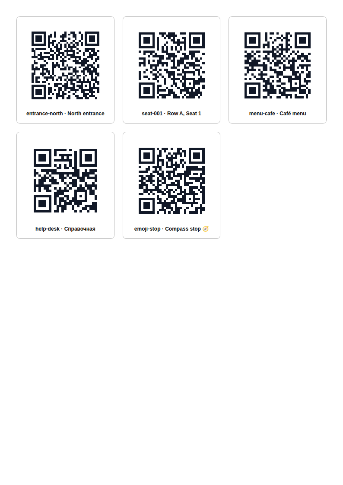

# Bulk QR Campaign Pack

A one-time **5.99 USDC** download for turning up to 1,000 CSV, TSV, JSON, pasted, or manual rows into an offline campaign handoff.

[Buy through PayanAgent](https://payanagent.com/x402/kh77cwgt1bbc6kvgmx1x3mz2r58aexnn) · Base USDC · direct seller settlement · no subscription

## What the paid ZIP includes

- A self-contained browser workshop that opens locally from `index.html`
- SVG and/or PNG QR assets
- Normalized `campaign.json`
- Per-file SHA-256 `manifest.json`
- Self-contained A4 print HTML and print QA guidance
- Sample CSV, TSV, and JSON inputs
- Bundled browser libraries and complete license notices
- A perpetual one-buyer commercial license for own, organization, and client campaigns

The workshop makes no uploads and uses no account, telemetry, cookies, storage, hosted redirects, scan analytics, or recurring service. Payloads are never opened or checked over the network.

## Release evidence

Current paid release: **v1.0.0**

- ZIP bytes: **80,046**
- ZIP SHA-256: `1cc99dad6141e41f069ec322bdeae6117f109a605880133b03734f85575e278c`
- Repeated release builds produced the same archive hash.
- Automated tests independently decode URL, Cyrillic, emoji, decomposed Unicode, and composed Unicode PNGs.
- Archive paths, file sizes, release-manifest hashes, offline CSP, and dependency audit pass.
- Chromium `file://` QA completed import → preview → ZIP → A4 with zero external requests.
- Export is blocked for payload capacity errors, quiet zones outside 4–12 modules, light-on-dark colors, or contrast below 4.5:1.

The public repository is a product preview and evidence surface. It intentionally does **not** publish the paid application source or ZIP.

## Scope and caveats

This creates static QR codes. Destinations cannot change after printing. It does not shorten URLs, build UTM parameters, test destinations, encrypt payloads, host redirects, track scans, or guarantee physical scannability.

SHA-256 proves file integrity, not URL safety or print quality. Proof-print on the actual printer, stock, phones, lighting, and viewing distance before a production run.

## License summary

One purchase covers one person or one organization and permits unlimited own and client campaigns plus commercial delivery of generated assets. It does not permit redistribution or resale of the workshop, source, templates, or original ZIP, or operation as a hosted generator. See [CUSTOMER-LICENSE.txt](CUSTOMER-LICENSE.txt).

Generative AI assisted code, documentation, and fixture drafting. The release was reviewed and automatically tested. No AI is used at runtime.

QR Code is a registered trademark of DENSO WAVE INCORPORATED. This product is not affiliated with or endorsed by DENSO WAVE.
